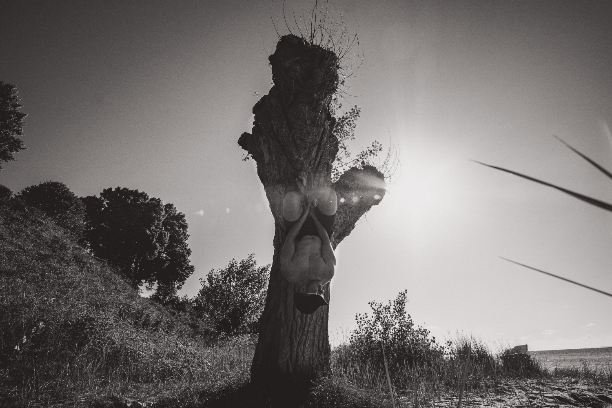

I have been working as a Malware Analyst for GDATA CyberDefense AG from January 2015 to October 2022.

Half of my work time was devoted to the creation of detection signatures for GDATA antivirus products. The other half I worked for the Public Relations department which included providing technical background checks for articles and statements, talks, webinars, interviews and writing blog articles for GDATA Techblog. 

Since November 2015 I am Lead Engineer for a small team. Our main responsibility is the improvement of detection and prevention technologies for GDATA's mEDR product. 