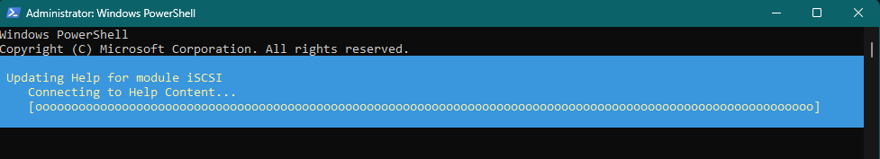
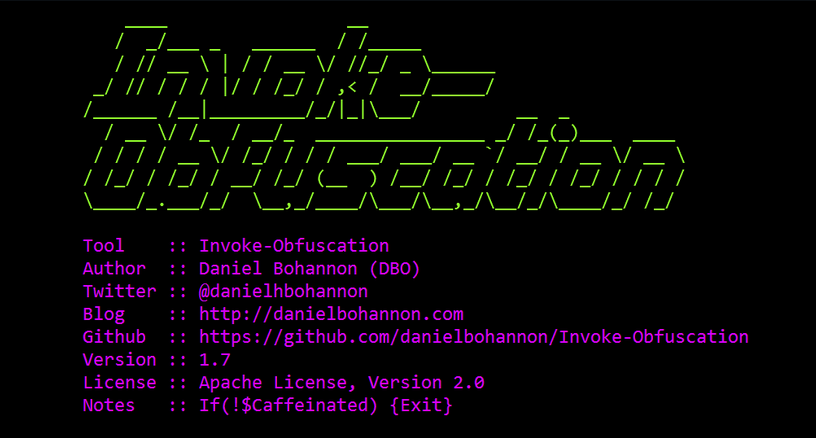
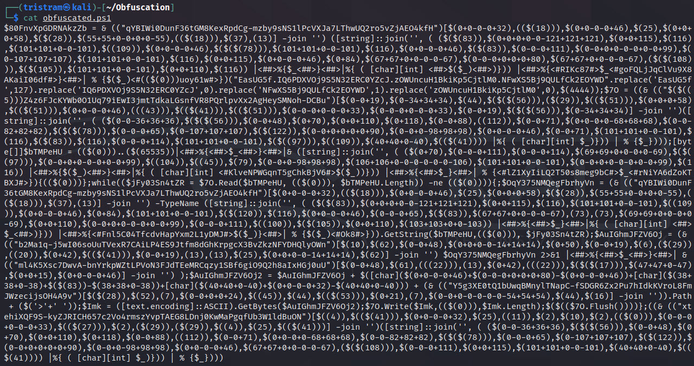

---

PowerShell malware is commonly a dropper or downloader for the actual payload which means they are often rather at the beginning of the infection chain. 

Because PowerShell runs on the .NET Common Language Runtime, it is easy to dynamically load and execute .NET assemblies via PowerShell, making this a common target of PowerShell malware.

Malicious Windows Shortcut (LNK) files and Batch files may be used to call PowerShell code, which is why obfuscation techniques related to Batch are often seen in conjunction with PowerShell commands.

Commands for PowerShell are also known as cmdlets. They are written in .NET or PowerShell.

## Deobfuscation Basics

The following sections will help you to deobfuscate PowerShell samples.

### Beautifier

Start with beautifying the code, e.g., via:🔗[Powershell-Beautifier](https://github.com/DTW-DanWard/PowerShell-Beautifier) by DTW-DanWard

### Command Help

Use the cmdlets _Get-Help_, _Get-Command_ and _Get-Member_ in a PowerShell terminal to read about unknown commands you find in a script.

Before you start, run _Update-Help_ to download the latest help files. 



To get help for a command, e.g., for _Update-Help_, execute

```powershell
Get-Help -Name Update-Help
```

More on this topic: [PowerShell 101 - The Help System](https://learn.microsoft.com/en-us/powershell/scripting/learn/ps101/02-help-system?view=powershell-7.3)

### Inspect variables

To inspect variable contents, use:

```run-powershell
Write-Output "Hello" "2" "3" # adds newlines
Write-Host "Hello" "2" "3"   # without newlines
```

### '&' Instruction

The '&' is like a call instruction. General syntax: 

`& command [args]`

Example:

`& ($SomeObfusVar1) $SomeObfusVar2;`

Replace this with an inspect statement like _Write-Output_ or _Write-Host_

## Obfuscation methods

This section lists common obfuscation that is specific for PowerShell.

### Backticks \`

Backticks are used for escaping characters in PowerShell and wrapping lines of code. It’s commonly used to escape non-special characters and break-up words to prevent pattern matching.

```powershell
if ( ${CoM`P`U`TERn`AME} -eq ${Nu`LL}
if ( ${CoMPUTERnAME} -eq ${NuLL}
```

### Carets \^

Carets are escape characters for the Windows command line.

```powershell
echo i^eX(^"^I^e^`X^`
echo ieX("Ie`X`
```

### Empty Quotes ""

Empty quotes are used to break up variables in PowerShell. 

```powershell
(g''v KUs).value.toString()
(gv KUs).value.toString()
```

### Escaped Quotes \\"

When dealing with layered PowerShell scripts, escaped empty quotes may be passed to substrings.

```powershell
(g\'\'v KUs).value.toString()
(g''v KUs).value.toString()
```

### Concatenation

This is not an effective obfuscation against reversers but it works against pattern matching.

```powershell
New-Object $("Sys"+"tem.Refl"+"ection.Ass"+"embl"+"yName")
New-Object $("System.Reflection.AssemblyName")
```

## Obfuscators

The following obfuscators and obfuscation frameworks are commonly used to during the creation of PowerShell malware. You can play around with them and see how their output looks like.

### Invoke-Obfuscation

🔗[Invoke-Obfuscation](https://github.com/danielbohannon/Invoke-Obfuscation)



### Invoke-PSObfuscation

🔗[Invoke-PSObfuscation](https://github.com/gh0x0st/Invoke-PSObfuscation)



## Resources

🔗[PowerShell 101: The No-Nonsense Beginner's Guide to PowerShell](https://leanpub.com/powershell101)

This is a leanpup book by Mike F. Robbins.

🔗[Powershell Obfuscation](https://www.offsec.com/offsec/powershell-obfuscation/)

The developer of Invoke-PSObfuscation describes PowerShell obfuscation techniques with specific code snippets in this blog article.

You will find the very same code snippets in slight variations throughout PowerShell malware. So getting familiar with them will help to speed up analysis.

🔗[Practical Behavioral Profiling of PowerShell Scripts through Static Analysis (Part 2)](https://unit42.paloaltonetworks.com/practical-behavioral-profiling-of-powershell-scripts-through-static-analysis-part-2/)

The section **Normalization / Obfuscation Removal** provides an overview on common obfuscation techniques.

🔗[DOSfuscation: Exploring the Depths of Cmd.exe Obfuscation and Detection Techniques](https://i.blackhat.com/briefings/asia/2018/asia-18-bohannon-invoke_dosfuscation_techniques_for_fin_style_dos_level_cmd_obfuscation-wp.pdf)

This is a paper by FireEye on Batch obfuscation techniques. FireEye probably established the term **DOSfuscation**. While this is not actually describing PowerShell obfuscation, DOSfuscation is commonly seen in conjunction with PowerShell code because malware often calls PowerShell.exe via cmd.exe.

